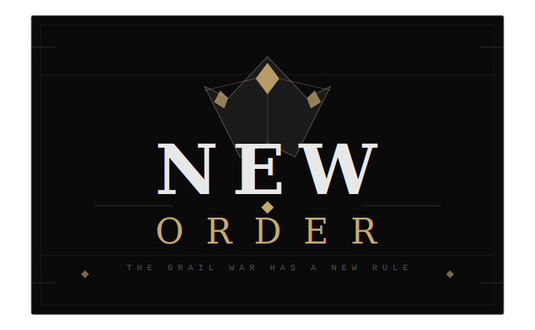

  

# New Order

A branching, choice-driven Pygame narrative game set during a Grail War-style conflict in Lucknow.

## What It Is

New Order is a keyboard-first, windowed story game where each route follows a different protagonist arc. Player choices update route-specific variables, flags, and endings, with slot-based save persistence.

## Phase Status

- Phase 1 narrative arc is complete.
- All six core routes are implemented as dedicated modular route systems.

## Technical Snapshot

- Language: Python
- Framework: Pygame
- Rendering: 1280x720 window, black UI theme, white text, highlighted selection bars, SVG logo background
- Input: Arrow keys for navigation, Enter to confirm, Esc to return/save from route scenes
- Persistence: Multi-slot JSON save files in the saves folder
- Logging: Runtime and failure logs written to game.log
- Logo loading: Native Pygame SVG loading (CairoSVG path removed)

## Current Route Status

- Lancer: Complete
- Archer: Complete
- Caster: Complete
- Assassin: Complete
- Rider: Complete
- Berserker: Complete (special logic route)

## Berserker Special Mechanics

- Burning Ache: Passive pressure increases each decision turn and can be reduced through combat or active hunt choices.
- Rage and memory interaction: High ache can increase rage and reduce memory retention.
- Dual ending logic: True Ending (Salvation) and Bad Ending (Consumption) are resolved by route flags and tracked stat thresholds.
- Pre-ending requirements check: The route displays a pass/fail diagnostic screen before final ending resolution.

## Project Structure

- game.py: Main app loop and menu flow
- game_core/constants.py: Global constants and route list
- game_core/storage.py: Save/load and logging setup
- game_core/ui.py: Shared drawing and menu UI helpers
- game_core/routes.py: Route dispatcher
- game_core/lancer_data.py + game_core/lancer_route.py: Lancer route content and runtime
- game_core/archer_data.py + game_core/archer_route.py: Archer route content and runtime
- game_core/caster_data.py + game_core/caster_route.py: Caster route content and runtime
- game_core/assassin_data.py + game_core/assassin_route.py: Assassin route content and runtime
- game_core/rider_data.py + game_core/rider_route.py: Rider route content and runtime
- game_core/berserker_data.py + game_core/berserker_route.py: Berserker route content and runtime

## Run

1. Install dependencies:
   - pip install pygame
2. Start the game:
   - python game.py
